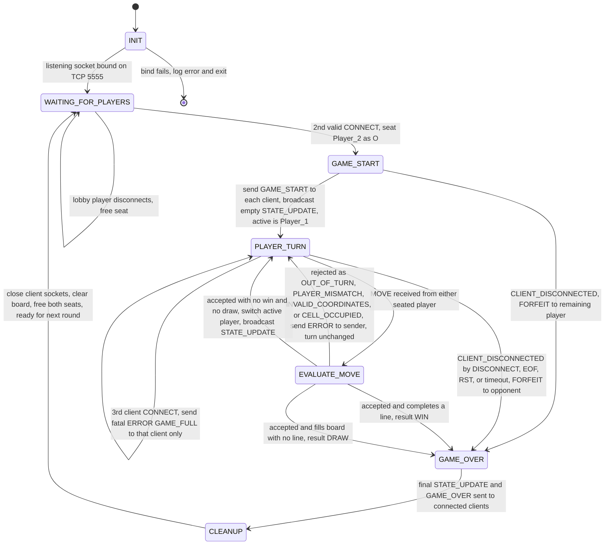

# Game State Machine (FSM) Specification

**Project:** cs457-tictactoe
**Author:** Jake VanAllen
**Sprint:** 1 (Protocol and FSM Design)
**Companion document:** [`protocol_blueprint.md`](protocol_blueprint.md)

This document defines the server-side state machine that governs the Tic-Tac-Toe game engine. The server is the only component that holds game state. Clients send requests and render what the server tells them. Every message type, field, and error code referenced here is defined in `protocol_blueprint.md`.

---

## 1. State Diagram

---

## 2. Server Game Context

The FSM operates on a single game context. These values are created in `INIT`, set during play, and reset in `CLEANUP`.

| Variable | Type | Initial value | Meaning |
|---|---|---|---|
| `state` | enum | `INIT` | Current FSM state. |
| `seats` | map of player ID to connection | empty | `Player_1` and `Player_2` once seated. |
| `aliases` | map of player ID to string | empty | Display names from `CONNECT`. |
| `board` | 3x3 array | all `"-"` | Authoritative board. |
| `active_player` | string or null | null | ID of the player allowed to move. |
| `move_number` | integer | 0 | Count of accepted moves. |
| `pending_move` | object or null | null | The `MOVE` currently being evaluated. Only set in `EVALUATE_MOVE`. |

---

## 3. State Definitions

| State | Purpose | Messages the server accepts here | Exit condition |
|---|---|---|---|
| `INIT` | Create the listening socket, bind to port 5555, start listening, and initialize the game context. | None. No clients are connected yet. | Socket bound successfully, or bind failure ends the process. |
| `WAITING_FOR_PLAYERS` | Lobby. Accept connections and seat players in connection order. | `CONNECT`, `DISCONNECT` | A second valid `CONNECT` fills both seats. |
| `GAME_START` | Transitional. Announce the match, assign roles, and send the empty board. | None. The server only sends in this state. | All start messages sent, or a seated client disconnects. |
| `PLAYER_TURN` | Wait for the active player's move. | `MOVE`, `DISCONNECT` | A `MOVE` arrives, or a seated client disconnects. |
| `EVALUATE_MOVE` | Transitional. Validate the pending move, apply it, and check for a win or draw. | None. The server is processing one move. | Move rejected, move accepted with play continuing, or game decided. |
| `GAME_OVER` | Transitional. Send the final outcome to every still-connected client. | None. | Outcome sent. |
| `CLEANUP` | Close client sockets, reset the game context, and keep the listening socket open. | None. | Reset complete. |

`GAME_START`, `EVALUATE_MOVE`, `GAME_OVER`, and `CLEANUP` are transitional states. The server passes through each of them while handling a single event and never waits for network input while in them.

---

## 4. Transition Table

Each row is one arrow in the diagram. The guard is the condition that must be true for the transition to fire. The action is what the server does as it moves to the next state.

| # | From | Event | Guard | Action | To |
|---|---|---|---|---|---|
| T1 | `INIT` | Startup | `bind()` and `listen()` succeed | Initialize game context | `WAITING_FOR_PLAYERS` |
| T2 | `INIT` | Startup | `bind()` fails | Log error, exit with nonzero status | End |
| T3 | `WAITING_FOR_PLAYERS` | `CONNECT` | Valid alias, no seats filled | Seat sender as `Player_1` with mark `X`. Send `LOBBY_WAIT`. | `WAITING_FOR_PLAYERS` |
| T4 | `WAITING_FOR_PLAYERS` | `CONNECT` | Invalid alias, or sender already seated | Send `ERROR` (`INVALID_ALIAS` or `ALREADY_CONNECTED`). | `WAITING_FOR_PLAYERS` |
| T5 | `WAITING_FOR_PLAYERS` | Bad frame | Fails envelope validation, or `MOVE` sent before game | Send `ERROR` (`MALFORMED_MESSAGE`, `UNKNOWN_MSG_TYPE`, or `NOT_IN_GAME`). | `WAITING_FOR_PLAYERS` |
| T6 | `WAITING_FOR_PLAYERS` | `CLIENT_DISCONNECTED` | Seated lobby player leaves | Close socket, free the seat. No `GAME_OVER`. | `WAITING_FOR_PLAYERS` |
| T7 | `WAITING_FOR_PLAYERS` | `CONNECT` | Valid alias, `Player_1` seated | Seat sender as `Player_2` with mark `O`. | `GAME_START` |
| T8 | `GAME_START` | Entry | Both clients reachable | Send each client its own `GAME_START`. Broadcast `STATE_UPDATE` with empty board. Set `active_player` to `Player_1`. | `PLAYER_TURN` |
| T9 | `GAME_START` | `CLIENT_DISCONNECTED` | A send fails or a client drops during setup | Record `FORFEIT`, winner is the remaining player. | `GAME_OVER` |
| T10 | `PLAYER_TURN` | `MOVE` | Sender is a seated player | Store as `pending_move`. | `EVALUATE_MOVE` |
| T11 | `PLAYER_TURN` | Bad frame | Fails envelope validation or wrong type | Send `ERROR` to sender only. Board and turn unchanged. | `PLAYER_TURN` |
| T12 | `PLAYER_TURN` | `CONNECT` | Sender is a new, unseated connection | Send `ERROR` `GAME_FULL` with `fatal: true`, close that socket only. | `PLAYER_TURN` |
| T13 | `PLAYER_TURN` | `CLIENT_DISCONNECTED` | A seated player sends `DISCONNECT`, hits EOF, raises a socket exception, or times out | Record `FORFEIT`, winner is the opponent. | `GAME_OVER` |
| T14 | `EVALUATE_MOVE` | Validation | Any check in the move validation order fails | Send `ERROR` to sender with the matching code. Clear `pending_move`. Board and `active_player` unchanged. | `PLAYER_TURN` |
| T15 | `EVALUATE_MOVE` | Validation | Move valid, no winning line, board not full | Apply mark, increment `move_number`, switch `active_player`, broadcast `STATE_UPDATE`. | `PLAYER_TURN` |
| T16 | `EVALUATE_MOVE` | Validation | Move valid and completes one of the 8 lines | Apply mark, record `WIN` and the winning line. | `GAME_OVER` |
| T17 | `EVALUATE_MOVE` | Validation | Move valid, no winning line, all 9 cells filled | Apply mark, record `DRAW`. | `GAME_OVER` |
| T18 | `GAME_OVER` | Entry | None | Broadcast final `STATE_UPDATE` with `active_player: null` (WIN or DRAW only), then `GAME_OVER` to every connected client. | `CLEANUP` |
| T19 | `CLEANUP` | Entry | None | Close both client sockets, reset context to initial values, keep listening socket open. | `WAITING_FOR_PLAYERS` |

---

## 5. Move Evaluation Logic

`EVALUATE_MOVE` applies the checks below in order and stops at the first failure. These are checks 2 through 5 from section 3.5 of the protocol blueprint. Check 1 there (`NOT_IN_GAME`) is already guaranteed by the FSM, because a `MOVE` only reaches `EVALUATE_MOVE` from `PLAYER_TURN`.

| Order | Check | Failure code |
|---|---|---|
| 1 | `player_id` in the message matches the seat bound to this connection | `PLAYER_MISMATCH` |
| 2 | `player_id` equals `active_player` | `OUT_OF_TURN` |
| 3 | `row` and `col` are integers from 0 to 2, and not booleans | `INVALID_COORDINATES` |
| 4 | `board[row][col]` is `"-"` | `CELL_OCCUPIED` |

If every check passes, the server applies the mark and then evaluates the outcome:

1. **Win check first.** Test the 8 lines (3 rows, 3 columns, 2 diagonals). If all three cells in a line hold the mover's mark, the result is `WIN`.
2. **Draw check second.** If no line is complete and `move_number` is 9, the result is `DRAW`.
3. **Otherwise** play continues and the turn passes to the other player.

Because the win check runs before the draw check, a ninth move that also completes a line is scored as a `WIN`.

---

## 6. Edge Cases and Failure Paths

| Scenario | State when it happens | Server behavior | Resulting state |
|---|---|---|---|
| Player 2 moves when it is Player 1's turn | `PLAYER_TURN` | `ERROR` `OUT_OF_TURN` to Player 2 only. Loop continues. | `PLAYER_TURN` |
| Move to an occupied cell | `PLAYER_TURN` | `ERROR` `CELL_OCCUPIED`. Same player keeps the turn. | `PLAYER_TURN` |
| Coordinates out of range or wrong type, such as `{"row":3,"col":"a"}` | `PLAYER_TURN` | `ERROR` `INVALID_COORDINATES`. Same player keeps the turn. | `PLAYER_TURN` |
| Client sends a non-JSON line or an unknown `msg_type` | Any waiting state | `ERROR` `MALFORMED_MESSAGE` or `UNKNOWN_MSG_TYPE`. The connection stays open. | Unchanged |
| Client sends 4096 bytes with no newline | Any waiting state | Fatal `ERROR` `MESSAGE_TOO_LARGE`, close that connection. Treated as a disconnect for that player. | Per disconnect rows below |
| Lone player leaves the lobby | `WAITING_FOR_PLAYERS` | Free the seat. No `GAME_OVER`. | `WAITING_FOR_PLAYERS` |
| Player sends `DISCONNECT` mid-game | `PLAYER_TURN` | `GAME_OVER` `FORFEIT` to opponent, then cleanup. | `GAME_OVER` then `CLEANUP` |
| Player's process exits without `DISCONNECT` (`recv()` returns `b""`) | `PLAYER_TURN` | Same as above. | `GAME_OVER` then `CLEANUP` |
| Player crashes or CML link is cut (`ConnectionResetError`, `BrokenPipeError`, or 120 second timeout) | `PLAYER_TURN` | Same as above. | `GAME_OVER` then `CLEANUP` |
| Both players drop at the same time | `PLAYER_TURN` | First detected drop triggers `FORFEIT`. Sending `GAME_OVER` to the other also fails, so the server logs it and proceeds. | `GAME_OVER` then `CLEANUP` |
| Third client connects during a game | `PLAYER_TURN` | Fatal `ERROR` `GAME_FULL` to the newcomer only. The running game is not affected. | `PLAYER_TURN` |
| Game ends normally | `EVALUATE_MOVE` | `GAME_OVER` to both, close sockets, reset context. | `WAITING_FOR_PLAYERS` for the next round |

---

## 7. Disconnect Detection Feeding the FSM

Every disconnect path produces one internal event, `CLIENT_DISCONNECTED(player_id)`. The FSM reacts to that event the same way regardless of how it was detected.

| Detection path | How the server sees it |
|---|---|
| Graceful application quit | A `DISCONNECT` message arrives. |
| Clean TCP close (FIN) | `recv()` returns `b""` (EOF). |
| Abrupt reset (RST) | `ConnectionResetError` or `ConnectionAbortedError` is raised. |
| Write to a closed peer | `BrokenPipeError` is raised on `sendall()`. |
| Silent link failure | No data for 120 seconds raises `socket.timeout`. |

Each receive and send call is wrapped so that any of these paths raises `CLIENT_DISCONNECTED` instead of crashing the server loop.

---

## 8. Concurrency Note for Sprint 2

The FSM assumes events are processed one at a time. Two `MOVE` messages arriving at nearly the same moment must not both be evaluated against the same board. Whatever concurrency model is chosen in Sprint 2, whether threads with a lock around the game context or a single `select()` loop, it must deliver events to the FSM serially. A disconnect that is detected while a move is being evaluated is queued and handled as soon as `EVALUATE_MOVE` finishes.
